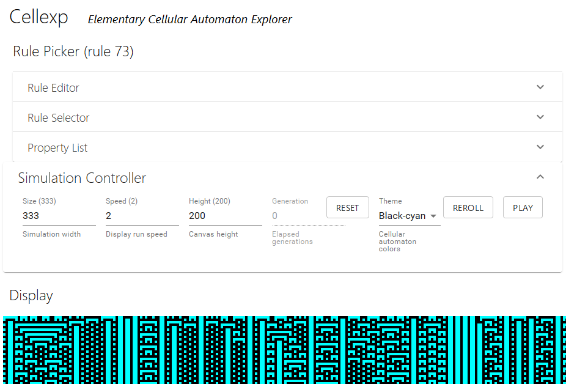

# Cellexp - Cellular Automaton Explorer 1d

A cellular automaton (CA) explorer to understand and unveil properties of CAs in 1D.

## Try it out

The first version of the Cellexp has been [deployed to Github Pages](https://cellexp.github.io/index.html).

## Alternatives

[ECAX](https://www.xanxys.net/ecax/) - Zoom, Navigation, Compute-on-demand
[ECA Canvas](http://www.cs.swan.ac.uk/~csandy/research/play/ca/) - Size, Border, Random
[Celldemo](http://devinacker.github.io/celldemo/) - Autoscrolling, Impuse, Random proportion,
[WoflramAlpha](https://www.wolframalpha.com/input/?i=rule+110) - Description (symétries, propriétés, classe), Propagation differentielle

## Study and roadmap

Find the french presentation of the projet in [doc-projet-fr](./doc-project-fr/).
